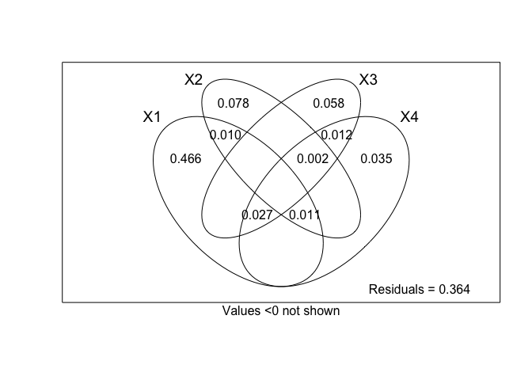

Multivar stats final project
================
Renata Diaz
11/23/2018

Project plan
------------

1.  Get data
    1.  load Portal rodent and plant data
    2.  summarize by year
    3.  standardize according to trapping/survey effort

2.  Reduce dimensionality of plant data
    1.  try LDA
        1.  If base LDA doesn't work, try removing 5% most/least common species

    2.  pcoa
    3.  separate winter/summer censuses a priori?

3.  Distance based redundancy analysis
    1.  try to use plant summary axes to predict rodent community
    2.  (?) Use LDA rodent topics as ind variable?

4.  Variance partitioning to isolate effects of year, plants on rodents

Get data
--------

### Plant data

-   Extracted summer & winter plant censuses for all years
-   Standardized plant abundances according to sampling effort
-   Kept seasons separate

### Rodent data

-   Rodent censuses on control plots for all years, restricted to granivores
-   Standardized according to sampling effort (per census period)
-   Summed across all months in each calendar year

PCoA
----

-   Ran separate principle coordinates analyses on winter and summer datasets.

### Summer PCoA

``` r
summer_plants_c <- read.csv('data/summer-control-plants-adjusted.csv',
                          stringsAsFactors = F)

summer_zeros <- read.csv('data/summer-exclosure-plants-adjusted.csv',
                          stringsAsFactors = F)

rmcols <- intersect(colnames(summer_plants_c), colnames(summer_zeros))
summer_zeros <- summer_zeros %>%
  filter(year %in% summer_plants_c$year) %>%
  select(-rmcols)
summer_zeros <- 0*(summer_zeros)

summer_plants_c <- cbind(summer_plants_c, summer_zeros)

summer_plants_c_wis <- vegan::wisconsin(summer_plants_c[,2:ncol(summer_plants_c)])

summer_dist_mat <- vegdist(summer_plants_c_wis, 'bray')
  
summer_pcoa <- cmdscale(summer_dist_mat, k = nrow(summer_plants_c_wis) - 1, eig = T)
```

    ## Warning in cmdscale(summer_dist_mat, k = nrow(summer_plants_c_wis) - 1, :
    ## only 26 of the first 31 eigenvalues are > 0

``` r
# Proportion of variance table 
  eigenvalues <- summer_pcoa$eig[1:nrow(summer_plants_c_wis)-1]
  propVar <- eigenvalues/sum(eigenvalues)
  cumVar <- cumsum(propVar)
  Summer_PCoA_Table <- cbind(eigenvalues, propVar, cumVar)
  
  Summer_PCoA_Table[1:15,]
```

    ##       eigenvalues    propVar    cumVar
    ##  [1,]   2.0563622 0.19712396 0.1971240
    ##  [2,]   1.5954394 0.15293967 0.3500636
    ##  [3,]   1.1052710 0.10595187 0.4560155
    ##  [4,]   0.8975092 0.08603571 0.5420512
    ##  [5,]   0.7196557 0.06898658 0.6110378
    ##  [6,]   0.6107483 0.05854666 0.6695844
    ##  [7,]   0.5406239 0.05182449 0.7214089
    ##  [8,]   0.4519055 0.04331990 0.7647288
    ##  [9,]   0.3638276 0.03487671 0.7996055
    ## [10,]   0.3379550 0.03239654 0.8320021
    ## [11,]   0.2934671 0.02813191 0.8601340
    ## [12,]   0.2832952 0.02715683 0.8872908
    ## [13,]   0.2765296 0.02650828 0.9137991
    ## [14,]   0.2183546 0.02093159 0.9347307
    ## [15,]   0.1745190 0.01672949 0.9514602

``` r
# Scree plot:
  plot(eigenvalues)
  lines(lowess(eigenvalues))
```


``` r
ordiplot(scores(summer_pcoa)[, c(1, 2)], type = "n", cex = 1, main = "Summer plant PCoA")
```

    ## species scores not available

``` r
## species scores not available
abline(h = 0, lty = 3)
abline(v = 0, lty = 3)

# Add species

species_pc <- wascores(summer_pcoa$points[, 1:2], summer_plants_c_wis)
text(species_pc, rownames(species_pc), cex = 0.7, col = "red")
```


There seems to be an inflection point in the scree plot around axis 3.

Moving forward, keeping the first 3 axes as predictor variables for the rodent community.

### Winter PCoA

``` r
winter_plants_c <- read.csv('data/winter-control-plants-adjusted.csv',
                          stringsAsFactors = F)


winter_zeros <- read.csv('data/winter-exclosure-plants-adjusted.csv',
                          stringsAsFactors = F)

rmcols <- intersect(colnames(winter_plants_c), colnames(winter_zeros))
winter_zeros <- winter_zeros %>%
  filter(year %in% winter_plants_c$year) %>%
  select(-rmcols)
winter_zeros <- 0*(winter_zeros)

winter_plants_c <- cbind(winter_plants_c, winter_zeros)

winter_plants_c_wis <- vegan::wisconsin(winter_plants_c[,2:ncol(winter_plants_c)])


winter_dist_mat <- vegdist(winter_plants_c_wis, 'bray')
  
winter_pcoa <- cmdscale(winter_dist_mat, k = nrow(winter_plants_c_wis) - 1, eig = T)
```

    ## Warning in cmdscale(winter_dist_mat, k = nrow(winter_plants_c_wis) - 1, :
    ## only 24 of the first 30 eigenvalues are > 0

``` r
# Proportion of variance table 
  eigenvalues <- winter_pcoa$eig[1:nrow(winter_plants_c_wis)-1]
  propVar <- eigenvalues/sum(eigenvalues)
  cumVar <- cumsum(propVar)
  winter_PCoA_Table <- cbind(eigenvalues, propVar, cumVar)
  
  winter_PCoA_Table[1:15,]
```

    ##       eigenvalues    propVar    cumVar
    ##  [1,]   2.5275311 0.23657509 0.2365751
    ##  [2,]   1.2362137 0.11570871 0.3522838
    ##  [3,]   1.1663015 0.10916498 0.4614488
    ##  [4,]   0.9459393 0.08853924 0.5499880
    ##  [5,]   0.7073594 0.06620833 0.6161963
    ##  [6,]   0.6626747 0.06202588 0.6782222
    ##  [7,]   0.5001731 0.04681584 0.7250381
    ##  [8,]   0.4794746 0.04487848 0.7699165
    ##  [9,]   0.3787435 0.03545012 0.8053667
    ## [10,]   0.3680192 0.03444633 0.8398130
    ## [11,]   0.3391073 0.03174020 0.8715532
    ## [12,]   0.2787566 0.02609142 0.8976446
    ## [13,]   0.2389512 0.02236566 0.9200103
    ## [14,]   0.2149838 0.02012233 0.9401326
    ## [15,]   0.1432808 0.01341098 0.9535436

``` r
# Scree plot:
  plot(eigenvalues)
  lines(lowess(eigenvalues))
```


``` r
ordiplot(scores(winter_pcoa)[, c(1, 2)], type = "n", cex = 1, main = "Winter plant PCoA")
```

    ## species scores not available

``` r
## species scores not available
abline(h = 0, lty = 3)
abline(v = 0, lty = 3)

# Add species

species_pc <- wascores(winter_pcoa$points[, 1:2], winter_plants_c_wis)
text(species_pc, rownames(species_pc), cex = 0.7, col = "red")
```


There seems to be an inflection point in the scree plot around axis 2 or 3. Since stopping at 2 would only capture 39% of variation, going to go for 3.

RDA
---

Redundancy analysis, using combined winter and summer axes and year to predict the rodent community.

Restricted to years with both a winter & summer census (n = 27).

``` r
rodents <- read.csv('data/rodents-adjusted.csv', 
                    stringsAsFactors = F)

summer_axes <- read.csv('models/Summer_pcoa_vals_3.csv', 
                        stringsAsFactors = F)

winter_axes <- read.csv('models/Winter_pcoa_vals_3.csv',
                        stringsAsFactors = F)


pred_vals <- inner_join(winter_axes, summer_axes, by = 'year')

rodents <- filter(rodents, year %in% pred_vals$year) %>%
  select(-year)

rodents_hel <- decostand(rodents, 'hellinger')

rodents_rda <- rda(rodents_hel ~ ., pred_vals)

R2 <- RsquareAdj(rodents_rda)$r.squared
R2adj <- RsquareAdj(rodents_rda)$adj.r.squared

R2
```

    ## [1] 0.7536799

``` r
R2adj
```

    ## [1] 0.6629304

``` r
anova(rodents_rda, step = 1000)
```

    ## Permutation test for rda under reduced model
    ## Permutation: free
    ## Number of permutations: 999
    ## 
    ## Model: rda(formula = rodents_hel ~ year + WinterPCoAxis_1 + WinterPCoAxis_2 + WinterPCoAxis_3 + SummerPCoAxis_1 + SummerPCoAxis_2 + SummerPCoAxis_3, data = pred_vals)
    ##          Df Variance      F Pr(>F)    
    ## Model     7 0.135895 8.3051  0.001 ***
    ## Residual 19 0.044414                  
    ## ---
    ## Signif. codes:  0 '***' 0.001 '**' 0.01 '*' 0.05 '.' 0.1 ' ' 1

``` r
anova(rodents_rda, by = "axis", step = 1000)
```

    ## Permutation test for rda under reduced model
    ## Forward tests for axes
    ## Permutation: free
    ## Number of permutations: 999
    ## 
    ## Model: rda(formula = rodents_hel ~ year + WinterPCoAxis_1 + WinterPCoAxis_2 + WinterPCoAxis_3 + SummerPCoAxis_1 + SummerPCoAxis_2 + SummerPCoAxis_3, data = pred_vals)
    ##          Df Variance       F Pr(>F)    
    ## RDA1      1 0.097911 41.8861  0.001 ***
    ## RDA2      1 0.020027  8.5676  0.001 ***
    ## RDA3      1 0.010442  4.4669  0.021 *  
    ## RDA4      1 0.004487  1.9196  0.543    
    ## RDA5      1 0.001858  0.7949  0.974    
    ## RDA6      1 0.000747  0.3196  0.999    
    ## RDA7      1 0.000423  0.1808  0.999    
    ## Residual 19 0.044414                   
    ## ---
    ## Signif. codes:  0 '***' 0.001 '**' 0.01 '*' 0.05 '.' 0.1 ' ' 1

Find the most parsimonious model...

``` r
set.seed(11)
step.forward <- ordiR2step(rda(rodents_hel ~ 1, data = pred_vals), scope = formula(rodents_rda), 
                           R2scope = F, direction = "forward", pstep = 1000)
```

    ## Step: R2.adj= 0 
    ## Call: rodents_hel ~ 1 
    ##  
    ##                   R2.adjusted
    ## + WinterPCoAxis_1 0.465049255
    ## + year            0.393001013
    ## + SummerPCoAxis_1 0.206065354
    ## + WinterPCoAxis_3 0.074648682
    ## + WinterPCoAxis_2 0.069658749
    ## + SummerPCoAxis_2 0.044966946
    ## + SummerPCoAxis_3 0.004595451
    ## <none>            0.000000000
    ## 
    ##                   Df     AIC      F Pr(>F)   
    ## + WinterPCoAxis_1  1 -61.222 23.603  0.002 **
    ## ---
    ## Signif. codes:  0 '***' 0.001 '**' 0.01 '*' 0.05 '.' 0.1 ' ' 1
    ## 
    ## Step: R2.adj= 0.4650493 
    ## Call: rodents_hel ~ WinterPCoAxis_1 
    ##  
    ##                   R2.adjusted
    ## + WinterPCoAxis_3   0.5314926
    ## + WinterPCoAxis_2   0.5312382
    ## + year              0.5233258
    ## + SummerPCoAxis_2   0.5047420
    ## + SummerPCoAxis_1   0.5043222
    ## + SummerPCoAxis_3   0.4744154
    ## <none>              0.4650493
    ## 
    ##                   Df     AIC      F Pr(>F)   
    ## + WinterPCoAxis_3  1 -63.905 4.5455  0.002 **
    ## ---
    ## Signif. codes:  0 '***' 0.001 '**' 0.01 '*' 0.05 '.' 0.1 ' ' 1
    ## 
    ## Step: R2.adj= 0.5314926 
    ## Call: rodents_hel ~ WinterPCoAxis_1 + WinterPCoAxis_3 
    ##  
    ##                   R2.adjusted
    ## + WinterPCoAxis_2   0.6010456
    ## + SummerPCoAxis_2   0.5776599
    ## + year              0.5773050
    ## + SummerPCoAxis_1   0.5754796
    ## + SummerPCoAxis_3   0.5437806
    ## <none>              0.5314926
    ## 
    ##                   Df     AIC      F Pr(>F)   
    ## + WinterPCoAxis_2  1 -67.393 5.1841  0.002 **
    ## ---
    ## Signif. codes:  0 '***' 0.001 '**' 0.01 '*' 0.05 '.' 0.1 ' ' 1
    ## 
    ## Step: R2.adj= 0.6010456 
    ## Call: rodents_hel ~ WinterPCoAxis_1 + WinterPCoAxis_3 + WinterPCoAxis_2 
    ##  
    ##                   R2.adjusted
    ## + SummerPCoAxis_2   0.6356186
    ## + year              0.6339571
    ## + SummerPCoAxis_3   0.6169246
    ## + SummerPCoAxis_1   0.6054026
    ## <none>              0.6010456
    ## 
    ##                   Df     AIC      F Pr(>F)   
    ## + SummerPCoAxis_2  1 -69.041 3.1823  0.004 **
    ## ---
    ## Signif. codes:  0 '***' 0.001 '**' 0.01 '*' 0.05 '.' 0.1 ' ' 1
    ## 
    ## Step: R2.adj= 0.6356186 
    ## Call: rodents_hel ~ WinterPCoAxis_1 + WinterPCoAxis_3 + WinterPCoAxis_2 +      SummerPCoAxis_2 
    ##  
    ##                   R2.adjusted
    ## + year              0.6718460
    ## + SummerPCoAxis_3   0.6531352
    ## + SummerPCoAxis_1   0.6413473
    ## <none>              0.6356186
    ## 
    ##        Df     AIC      F Pr(>F)   
    ## + year  1 -71.124 3.4287  0.004 **
    ## ---
    ## Signif. codes:  0 '***' 0.001 '**' 0.01 '*' 0.05 '.' 0.1 ' ' 1
    ## 
    ## Step: R2.adj= 0.671846 
    ## Call: rodents_hel ~ WinterPCoAxis_1 + WinterPCoAxis_3 + WinterPCoAxis_2 +      SummerPCoAxis_2 + year 
    ##  
    ##                   R2.adjusted
    ## <none>              0.6718460
    ## + SummerPCoAxis_1   0.6707815
    ## + SummerPCoAxis_3   0.6658002

``` r
# Most parsimonious is Call: rodents_hel ~ WinterPCoAxis_1 + WinterPCoAxis_3 + WinterPCoAxis_2 + SummerPCoAxis_2

rod_rda_pars <- rda(rodents_hel ~ WinterPCoAxis_1 + WinterPCoAxis_3 + WinterPCoAxis_2 + SummerPCoAxis_2, pred_vals)

R2p <- RsquareAdj(rod_rda_pars)$r.squared
R2adjp <- RsquareAdj(rod_rda_pars)$adj.r.squared

R2p
```

    ## [1] 0.6916773

``` r
R2adjp
```

    ## [1] 0.6356186

``` r
anova(rod_rda_pars, step = 1000)
```

    ## Permutation test for rda under reduced model
    ## Permutation: free
    ## Number of permutations: 999
    ## 
    ## Model: rda(formula = rodents_hel ~ WinterPCoAxis_1 + WinterPCoAxis_3 + WinterPCoAxis_2 + SummerPCoAxis_2, data = pred_vals)
    ##          Df Variance      F Pr(>F)    
    ## Model     4 0.124715 12.338  0.001 ***
    ## Residual 22 0.055593                  
    ## ---
    ## Signif. codes:  0 '***' 0.001 '**' 0.01 '*' 0.05 '.' 0.1 ' ' 1

``` r
anova(rod_rda_pars, by = "axis", step = 1000)
```

    ## Permutation test for rda under reduced model
    ## Forward tests for axes
    ## Permutation: free
    ## Number of permutations: 999
    ## 
    ## Model: rda(formula = rodents_hel ~ WinterPCoAxis_1 + WinterPCoAxis_3 + WinterPCoAxis_2 + SummerPCoAxis_2, data = pred_vals)
    ##          Df Variance       F Pr(>F)    
    ## RDA1      1 0.097772 38.6914  0.001 ***
    ## RDA2      1 0.016751  6.6288  0.001 ***
    ## RDA3      1 0.006741  2.6676  0.042 *  
    ## RDA4      1 0.003452  1.3660  0.208    
    ## Residual 22 0.055593                   
    ## ---
    ## Signif. codes:  0 '***' 0.001 '**' 0.01 '*' 0.05 '.' 0.1 ' ' 1

wisconsin trans on plant community data
=======================================

look @ contributions to plant community axes
============================================

look @ exclosures winter axes: krat effects
===========================================

Variance partitioning
---------------------

``` r
rod_part <- varpart(rodents_hel, ~ WinterPCoAxis_1, ~ WinterPCoAxis_3, ~  WinterPCoAxis_2, ~ SummerPCoAxis_2, data = pred_vals)
rod_part
```

    ## 
    ## Partition of variance in RDA 
    ## 
    ## Call: varpart(Y = rodents_hel, X = ~WinterPCoAxis_1,
    ## ~WinterPCoAxis_3, ~WinterPCoAxis_2, ~SummerPCoAxis_2, data =
    ## pred_vals)
    ## 
    ## Explanatory tables:
    ## X1:  ~WinterPCoAxis_1
    ## X2:  ~WinterPCoAxis_3
    ## X3:  ~WinterPCoAxis_2
    ## X4:  ~SummerPCoAxis_2 
    ## 
    ## No. of explanatory tables: 4 
    ## Total variation (SS): 4.688 
    ##             Variance: 0.18031 
    ## No. of observations: 27 
    ## 
    ## Partition table:
    ##                             Df R.square Adj.R.square Testable
    ## [aeghklno] = X1              1  0.48562      0.46505     TRUE
    ## [befiklmo] = X2              1  0.11024      0.07465     TRUE
    ## [cfgjlmno] = X3              1  0.10544      0.06966     TRUE
    ## [dhijkmno] = X4              1  0.08170      0.04497     TRUE
    ## [abefghiklmno] = X1+X2       2  0.56753      0.53149     TRUE
    ## [acefghjklmno] = X1+X3       2  0.56730      0.53124     TRUE
    ## [adeghijklmno] = X1+X4       2  0.54284      0.50474     TRUE
    ## [bcefgijklmno] = X2+X3       2  0.22476      0.16015     TRUE
    ## [bdefhijklmno] = X2+X4       2  0.18937      0.12181     TRUE
    ## [cdfghijklmno] = X3+X4       2  0.15135      0.08063     TRUE
    ## [abcefghijklmno] = X1+X2+X3  3  0.64708      0.60105     TRUE
    ## [abdefghijklmno] = X1+X2+X4  3  0.62639      0.57766     TRUE
    ## [acdefghijklmno] = X1+X3+X4  3  0.60824      0.55714     TRUE
    ## [bcdefghijklmno] = X2+X3+X4  3  0.26504      0.16918     TRUE
    ## [abcdefghijklmno] = All      4  0.69168      0.63562     TRUE
    ## Individual fractions                                         
    ## [a] = X1 | X2+X3+X4          1               0.46644     TRUE
    ## [b] = X2 | X1+X3+X4          1               0.07848     TRUE
    ## [c] = X3 | X1+X2+X4          1               0.05796     TRUE
    ## [d] = X4 | X1+X2+X3          1               0.03457     TRUE
    ## [e]                          0               0.01007    FALSE
    ## [f]                          0              -0.00556    FALSE
    ## [g]                          0              -0.01059    FALSE
    ## [h]                          0              -0.02555    FALSE
    ## [i]                          0              -0.00867    FALSE
    ## [j]                          0               0.01159    FALSE
    ## [k]                          0               0.01062    FALSE
    ## [l]                          0              -0.00614    FALSE
    ## [m]                          0               0.00220    FALSE
    ## [n]                          0               0.02655    FALSE
    ## [o]                          0              -0.00634    FALSE
    ## [p] = Residuals              0               0.36438    FALSE
    ## Controlling 2 tables X                                       
    ## [ae] = X1 | X3+X4            1               0.47651     TRUE
    ## [ag] = X1 | X2+X4            1               0.45585     TRUE
    ## [ah] = X1 | X2+X3            1               0.44089     TRUE
    ## [be] = X2 | X3+X4            1               0.08855     TRUE
    ## [bf] = X2 | X1+X4            1               0.07292     TRUE
    ## [bi] = X2 | X1+X3            1               0.06981     TRUE
    ## [cf] = X3 | X1+X4            1               0.05239     TRUE
    ## [cg] = X3 | X2+X4            1               0.04736     TRUE
    ## [cj] = X3 | X1+X2            1               0.06955     TRUE
    ## [dh] = X4 | X2+X3            1               0.00903     TRUE
    ## [di] = X4 | X1+X3            1               0.02590     TRUE
    ## [dj] = X4 | X1+X2            1               0.04617     TRUE
    ## Controlling 1 table X                                        
    ## [aghn] = X1 | X2             1               0.45684     TRUE
    ## [aehk] = X1 | X3             1               0.46158     TRUE
    ## [aegl] = X1 | X4             1               0.45978     TRUE
    ## [bfim] = X2 | X1             1               0.06644     TRUE
    ## [beik] = X2 | X3             1               0.09049     TRUE
    ## [befl] = X2 | X4             1               0.07685     TRUE
    ## [cfjm] = X3 | X1             1               0.06619     TRUE
    ## [cgjn] = X3 | X2             1               0.08550     TRUE
    ## [cfgl] = X3 | X4             1               0.03566     TRUE
    ## [dijm] = X4 | X1             1               0.03969     TRUE
    ## [dhjn] = X4 | X2             1               0.04717     TRUE
    ## [dhik] = X4 | X3             1               0.01097     TRUE
    ## ---
    ## Use function 'rda' to test significance of fractions of interest

``` r
plot(rod_part, digits = 2)
```



WinterPCoAxis\_1 has the largest chunk (.4)

### Years - rodents comparison

``` r
plot(pred_vals$year, pred_vals$WinterPCoAxis_1)
abline(v = 1990, col = 'red')
```


``` r
colnames(rodents)
```

    ##  [1] "BA" "DM" "DO" "DS" "PB" "PE" "PF" "PH" "PI" "PL" "PM" "PP" "RF" "RM"
    ## [15] "RO"

``` r
rodents_props <- rodents/rowSums(rodents)


plot(pred_vals$year, rodents_props$DS, col = 'blue')
points(pred_vals$year, rodents_props$PE, col = 'green')
points(pred_vals$year, rodents_props$RM, col = 'purple')
points(pred_vals$year, rodents_props$DM, col = 'pink')
abline(v = 1990, col = 'red')
```


I might be totally misinterpreting this, but I'm feeling like this indicates that the 1990 change point (which, if you look at the LDA results, is driven by a decline in RM & PE relative to DM) is a *delayed effect* of DS decline *moderated by winter plant community*???

Why I think this: \* DS changepoint is the mid 80s but DS continue to decline \* Correlated winter plants don't take off until the 90s \* PE/RM too rare to be driving the end of that change \* PE/RM seem to follow the DS into decline \* So if the plant change occurs after the DS change, and PM/RE are tracking the *plants*, the timing seems to make sense.

Let's look at that same PCOA axis in the *exclosures*...

``` r
winter_plants_e <- read.csv('data/winter-exclosure-plants-adjusted.csv',
                          stringsAsFactors = F)

winter_plants_e_wis <- vegan::wisconsin(winter_plants_e[,2:ncol(winter_plants_e)])


# winter_plants_e_wis <- winter_plants_e_wis %>%
#   select(colnames(winter_plants_c_wis))
# 
# (colnames(winter_plants_e_wis) == colnames(winter_plants_c_wis))
```
